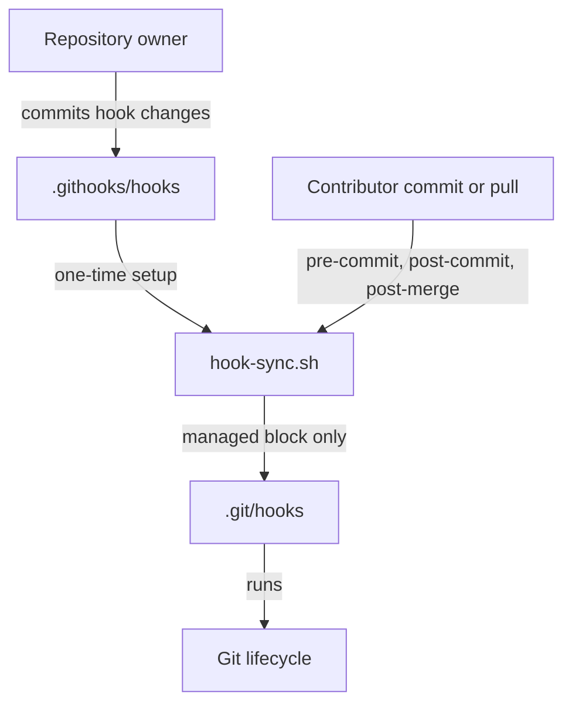

# 🚀 GitHub Repository Template

> A reusable GitHub repository template with documentation, pull-request automation, and repository-managed Git hooks. It is for teams that need consistent project conventions without prescribing an application language, framework, or build system.

---

## 📌 Project Metadata

* **Status:** 🟢 Active
* **Data Classification:** 🌐 Public

> ℹ️ *Use this section to identify which data classes the product handles: Public, Internal, Confidential, and Restricted.*
>
> 🧠 *These classifications align with the [NIST SP 800-122 Guide to Protecting the Confidentiality of Personally Identifiable Information (PII)](https://csrc.nist.gov/publications/detail/sp/800-122/final) framework. **Public** is explicitly classified as non-sensitive data outside NIST's non-public impact levels (Low, Moderate, and High).*

---

## 👥 Maintainers

| Name | Role | Contact |
| :--- | :--- | :--- |
| **Repository owner** | Template maintainer | Add the owning team or GitHub handle when creating a repository. |

---

## 🏗️ Architecture

The `.githooks` directory provides a language- and framework-agnostic way for repository owners to distribute Git hooks. Hook content lives in version control, while a small synchronizer installs or updates only the managed section of each contributor's local `.git/hooks` files.



## ⚡ Tech Stack

| Category | Technology | Usage |
| :--- | :--- | :--- |
| Version control | Git | Repository lifecycle and hook execution |
| Automation | Bash | Hook installation and synchronization |
| Quality | ShellCheck | Static analysis for shell scripts |
| Collaboration | GitHub Actions | Pull request checks and release workflows |

### ⭐ Repository-Managed Hooks

> **Component:** `.githooks`  
> **Responsibility:** Keep repository-owned Git hook content synchronized on contributor machines.  
> **Location:** `.githooks/`  
> **Interfaces:** Git `pre-commit`, `post-commit`, and `post-merge` hooks.

Run the setup script once after cloning:

```bash
bash .githooks/setup.sh
```

After setup, the `pre-commit`, `post-commit`, and `post-merge` lifecycle hooks run the synchronizer. When a repository owner changes a file under `.githooks/hooks/`, each contributor receives the change on their next commit or merge-based pull. Removing a managed source hook removes only its managed block from the local hook, leaving contributor-owned content intact.

Repository owners add hook behavior by creating a file named for a Git hook in `.githooks/hooks/`, such as `pre-push` or `commit-msg`, then committing it. Keep hook code portable and fail clearly when a required project tool is unavailable.

The synchronizer also deploys `.githooks/gitleaks.toml` to the Git-ignored `.gitleaks.toml` at the repository root, where the `pre-commit` secrets scan and local Gitleaks runs load it. Edit and commit `.githooks/gitleaks.toml` to change the rules; local edits to the deployed copy are overwritten.

## 📦 Installation

Create a repository from this template or clone an existing repository, then initialize its managed hooks:

```bash
git clone https://github.com/your-org/your-repo.git
cd your-repo
bash .githooks/setup.sh
```

The hook framework requires only Git and Bash. The baseline `pre-commit` hook also requires [Gitleaks](https://github.com/gitleaks/gitleaks) to scan staged changes for secrets. Application-specific prerequisites belong in the repository created from this template.

## 🛡️ Security

Git hooks execute local code. Treat changes under `.githooks/hooks/` and `.githooks/hook-sync.sh` as executable-code changes and review them with the same care as build or deployment scripts.

### Network exposure

| Port / Protocol | Exposure | Purpose | Authentication |
| :--- | :--- | :--- |
| N/A | N/A | This template does not expose a network service. | N/A |

### Data handled

| Data type | Examples | Classification | Storage / retention |
| :--- | :--- | :--- |
| Template content | Documentation, workflow definitions, and hook scripts | Public | Git repository history |
| Authentication material | Tokens, credentials, and private keys | Restricted | Do not commit; use an approved secret manager |

Repositories created from this template must update the project metadata and this table to identify every data class they handle. Never place secrets in hook scripts, configuration files, or Git history.

### Security controls

* Review hook changes as executable local automation.
* Keep secrets out of the repository and pass them through approved secret-management tooling.
* Run repository-specific security checks in GitHub Actions and, where appropriate, in managed hooks.
* Direct suspected vulnerabilities to the repository's security contact or `SECURITY.md`.

## 🛠️ Development

### Prerequisites

Install the tools required to use and validate the template locally:

* Git
* Bash
* [Gitleaks](https://github.com/gitleaks/gitleaks) for the `pre-commit` secrets scan
* [ShellCheck](https://www.shellcheck.net/) for shell-script validation

### Setup workspace

```bash
git clone https://github.com/your-org/your-repo.git
cd your-repo
bash .githooks/setup.sh
```

### Build

This repository is intentionally build-system agnostic. Add the build command for the selected application stack when creating a project from the template.

### Test and lint

```bash
shellcheck .githooks/hook-sync.sh .githooks/setup.sh .githooks/hooks/*
```